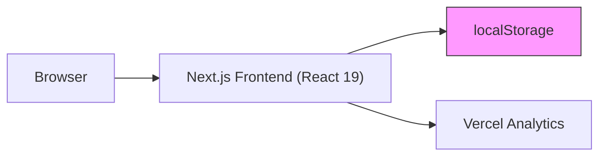
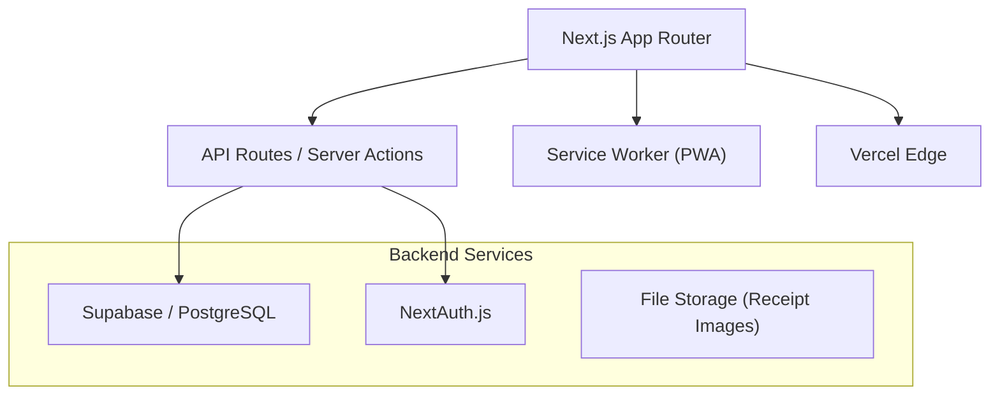

# SpendWise — Expense Tracker: Project Analysis

---

## 🧠 1. Project Summary

**SpendWise** is a frontend-only expense tracking application built for **students** (specifically Indian students based on INR defaults and UPI payment support). It provides a dashboard-driven interface to log daily expenses, set per-category budgets, and visualize spending patterns through charts and analytics.

| Attribute | Detail |
|---|---|
| **Tech Stack** | Next.js 16, React 19, TypeScript 5.7, Tailwind CSS v4, shadcn/ui (v4), Recharts, React Hook Form + Zod, date-fns |
| **Persistence** | Browser `localStorage` only — no backend or database |
| **Auth** | None — single hardcoded user profile |
| **Hosting** | Configured for Vercel (Vercel Analytics included) |
| **Target** | University students managing monthly budgets |

### Core Features Implemented
- **Expense CRUD** — Add, edit, delete expenses with category, payment method, date, amount, and recurring flag
- **Budget Tracking** — Per-category budget limits (monthly/weekly) with auto-calculated spent amounts
- **Dashboard** — Stats cards showing monthly/weekly/daily totals, remaining budget, over-budget alerts
- **Analytics** — 4 chart types: daily bar chart (7-day), weekly line trend, top categories bar, payment method pie chart
- **CSV Export** — Download all expenses as CSV
- **Responsive Design** — Mobile sidebar + adaptive card grid
- **Dark/Light Theme** — Theme provider included (via `next-themes`)

### Data Model
- **8 expense categories**: Food, Transport, Entertainment, Shopping, Utilities, Education, Health, Other
- **4 payment methods**: Cash, Card, UPI, Wallet
- **Recurring expense support** with daily/weekly/monthly frequency (metadata only — no auto-generation)

---

## ⚠️ 2. Gaps / Missing Pieces

### 🔴 Critical Gaps

| Gap | Impact |
|---|---|
| **No persistent backend** | All data lives in `localStorage`. Clearing browser data = total data loss. No cross-device access. |
| **No authentication** | Single hardcoded user. No login, no multi-user support. |
| **No data backup/sync** | No export to cloud, no import from CSV/JSON, no restore capability. |
| **No recurring expense automation** | `isRecurring` and `recurringFrequency` fields exist but are never processed — expenses are never auto-generated. |
| **Hardcoded currency (INR)** | [formatCurrency()](file:///d:/ExpenseTracker/components/dashboard/stats-cards.tsx#110-117) is duplicated across 3+ files and hardcoded to `en-IN` / `INR`, ignoring `user.currency`. |

### 🟡 Significant Gaps

| Gap | Impact |
|---|---|
| **No testing** | Zero unit tests, integration tests, or E2E tests. No test framework configured. |
| **No input validation at storage layer** | `JSON.parse()` from localStorage is unsanitized — corrupted data crashes the app. |
| **No error boundaries** | A single component error can crash the entire app. |
| **No PWA support** | No service worker, no offline capability, no install-to-home-screen — critical for a student budget app. |
| **No income tracking** | Only tracks spending — cannot calculate savings rate or net balance. |
| **Tab-based routing via state** | `activeTab` state means browser back/forward doesn't work; URLs don't reflect the current view. |
| **Duplicate [formatCurrency](file:///d:/ExpenseTracker/components/dashboard/stats-cards.tsx#110-117) functions** | Defined independently in [analytics-page.tsx](file:///d:/ExpenseTracker/components/dashboard/analytics-page.tsx) and [stats-cards.tsx](file:///d:/ExpenseTracker/components/dashboard/stats-cards.tsx) instead of shared utility. |
| **[use-mobile.ts](file:///d:/ExpenseTracker/hooks/use-mobile.ts) and [use-toast.ts](file:///d:/ExpenseTracker/hooks/use-toast.ts) duplicated** | Exist in both `hooks/` and `components/ui/` directories. |

### 🟢 Minor Gaps

- No pagination for expense list (will become slow with 1000+ entries)
- No search/filter by description or date range in the expenses page
- No accessibility audit (ARIA labels, keyboard navigation)
- Meta description is generic; no Open Graph tags for sharing
- No `robots.txt` or `sitemap.xml`
- Favicon assets referenced but not verified as existing in `/public`

---

## 🚀 3. Features to Add (Prioritized)

### P0 — Must Have for Usability

| # | Feature | Rationale |
|---|---|---|
| 1 | **Backend + Database** (e.g., Supabase / Firebase / Prisma + PostgreSQL) | Data persistence is non-negotiable for a real product. |
| 2 | **Authentication** (NextAuth.js / Supabase Auth / Clerk) | Multi-user support, secure data isolation. |
| 3 | **Fix currency to use `user.currency`** | Respect the user's currency setting instead of hardcoded INR. Create a shared `formatCurrency(amount, currency)` utility. |
| 4 | **URL-based routing** (Next.js App Router pages: `/dashboard`, `/expenses`, `/budgets`, `/analytics`) | Browser navigation, deep linking, shareable URLs. |
| 5 | **Error boundaries + localStorage validation** | Prevent total app crashes from corrupted data. |

### P1 — High Value

| # | Feature | Rationale |
|---|---|---|
| 6 | **Recurring expense engine** | Auto-generate expenses based on frequency. Currently the data model supports it but logic is missing. |
| 7 | **Income tracking** | Track stipends, part-time earnings, allowances. Show net savings. |
| 8 | **Data import/export (JSON + CSV)** | Import from bank statements or other apps. Current CSV export is one-way. |
| 9 | **PWA (Progressive Web App)** | Offline access, installable on phone — ideal for student use case. |
| 10 | **Budget alerts/notifications** | Push notifications or in-app alerts when approaching 80%/100% of a category budget. |

### P2 — Nice to Have

| # | Feature | Rationale |
|---|---|---|
| 11 | **Receipt image upload** (via camera or file) | Attach proof-of-purchase to expenses. |
| 12 | **Split expenses** | Students frequently split bills. Track shared costs with friends. |
| 13 | **Multi-currency support** | International students need currency conversion. |
| 14 | **Monthly/yearly reports** (PDF export) | Printable summaries for parents or scholarship audits. |
| 15 | **Dark mode toggle** | `ThemeProvider` is imported but not wired into the UI header (no visible toggle). |

---

## 🏗️ 4. Architecture / Tech Improvements

### Current Architecture

> [!WARNING]
> The current architecture is a **pure client-side SPA** with no backend. This is a single point of failure — all data is local and volatile.

### Recommended Target Architecture

### Specific Improvements

| Area | Current | Recommended |
|---|---|---|
| **State Management** | Custom hook + Context | Keep for simplicity, but add React Query/TanStack Query for server state when backend is added |
| **Data Layer** | Raw `localStorage` | Supabase client SDK or Prisma ORM with PostgreSQL |
| **Routing** | `useState('dashboard')` tab switching | Next.js App Router file-based pages (`/dashboard`, `/expenses`, etc.) |
| **Form Validation** | React Hook Form + Zod (✅ good) | No changes — this is solid |
| **Testing** | None | Add Vitest for unit tests, Playwright for E2E |
| **Error Handling** | None | Add React Error Boundaries, Sentry for monitoring |
| **Code Quality** | No lint config visible | Add ESLint strict config, Prettier, Husky pre-commit hooks |
| **CI/CD** | None | GitHub Actions: lint → test → build → deploy to Vercel |
| **Shared Utilities** | `formatCurrency()` duplicated | Extract into `lib/format.ts`, reference `user.currency` |
| **Component Organization** | Flat `dashboard/` dir | Group by feature: `features/expenses/`, `features/budgets/`, etc. |

---

## 🌍 5. Real-world Use Cases

| Use Case | Description |
|---|---|
| **University budget management** | Students track hostel mess fees, transport, books, and entertainment against a monthly allowance. |
| **Shared apartment expenses** | Roommates track and split rent, utilities, groceries (needs split-expense feature). |
| **Freelancer income/expense tracking** | Track project payments vs. operational costs (needs income tracking). |
| **Family budget app** | Parents set budgets for children; children log expenses (needs multi-user + roles). |
| **Travel expense tracker** | Track daily spending during trips with multi-currency support. |
| **Small business bookkeeping** | Simple expense tracking for micro-businesses (needs receipt uploads + tax categories). |

---

## 📈 6. Scalability & Future Enhancements

### Short-term (1–3 months)
- [ ] Add Supabase backend with auth — eliminates data loss risk
- [ ] Convert tab navigation to proper Next.js routes
- [ ] Implement PWA with offline support and app install
- [ ] Add Vitest unit test suite for `useExpenseStore` logic
- [ ] Fix shared utility duplication (`formatCurrency`, `use-mobile`, `use-toast`)

### Medium-term (3–6 months)
- [ ] Recurring expense automation engine (cron job or edge function)
- [ ] Income tracking + savings goals
- [ ] Bank statement import (CSV/OFX parsing)
- [ ] Push notifications for budget alerts (Web Push API)
- [ ] Monthly spending report generation (PDF via `@react-pdf/renderer`)

### Long-term (6–12 months)
- [ ] **AI-powered categorization** — Auto-categorize expenses from description text using an LLM
- [ ] **Spending predictions** — ML model to forecast month-end spending based on patterns
- [ ] **Multi-platform** — React Native mobile app sharing the same Supabase backend
- [ ] **Group expenses** — Shared wallets, split bills, debt settlement (like Splitwise)
- [ ] **Financial literacy module** — Tips, savings challenges, and spending insights for students
- [ ] **API integrations** — Connect with UPI apps (PhonePe, GPay), bank APIs for auto-import

### Performance Scaling Considerations
- Current `localStorage` approach will degrade with >5,000 expenses (JSON parse/stringify overhead)
- Move to indexed database (Supabase/PostgreSQL) with server-side pagination
- Add React.memo / virtualized lists for expense table rendering
- Consider edge caching for analytics computations

---

> [!NOTE]
> **Assumptions made**: (1) The project is at an early/prototype stage intended for academic or personal use. (2) "SpendWise" is the intended brand name (from layout metadata). (3) The target is primarily Indian students based on INR defaults, UPI support, and `.edu` email default. (4) No deployment has been done yet beyond local development. (5) The `v0.app` generator tag suggests this was scaffolded using Vercel's v0 AI tool.
